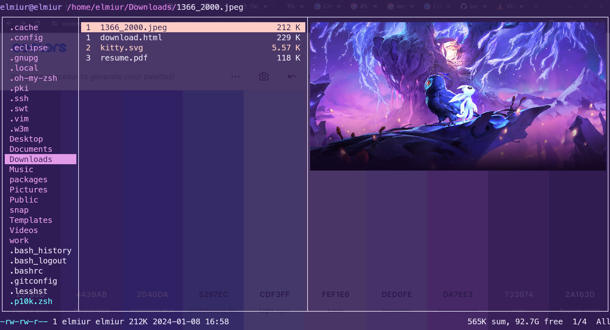

## ubuntu setup


This is my attempt to configure my ubuntu to needs for the future. This project will include
- nvim, tmux, ranger setup in `patagonia` theme
- install instructions all the packages that I use for daily workflow
- notes for certain setups and usage with personal keymaps


1. ## **build-essentials**
    ```sh 
    sudo apt install build-essential -y
    ```

1. ## **git**
    #### Install & Configure
    ```sh
    sudo apt install git -y &&
    git config --global user.name "woomiz" &&
    git config --global user.email "vishnups.developer@gmail.com"
    ```
    #### Setup SSH
    ```sh
    mkdir ~/.ssh &&
    cd ~/.ssh &&
    ssh-keygen -t ed25519
    ```
    
1. ## **curl**
    ```sh
    sudo apt install curl -y
    ```

1. ## **xclip**
    This will let me use + and * on nvim for clipboard copy and paste. 
    ```sh
    sudo apt update &&
    sudo apt install xclip -y
    ```

1. ## **kitty**
   Follow the directory for install instructions 

1. ## **Create a passwordless guest user**
    1. Create a user named `guest` with a temporary password
    1. Run the following command to replace the password
       ```sh
       sudo sed -i 's/(?<=guest:)[^\s:]+(?=:)/U6aMy0wojraho/' /etc/shadow
       ```

1. ## **FUSE**
    Read more in [here](https://github.com/AppImage/AppImageKit/wiki/FUSE)
    For Ubuntu (>= 22.04):

    ```sh
    sudo add-apt-repository universe &&
    sudo apt install libfuse2
    ```

1. ## **fnm**
    ```sh
    curl -fsSL https://fnm.vercel.app/install | bash &&
    fnm use 18
    ```

1. ## **vim**
    Follow the directory for install instructions

1. ## **neovim**
    Follow the directory for install instructions

1. ## **font-manager**
    This will help you install and manage fonts with ease for gnome distributions, find more [here](https://github.com/FontManager/font-manager).
    ```sh
    sudo add-apt-repository ppa:font-manager/staging
    sudo apt-get update
    sudo apt-get install font-manager
    ```

1. ## **zsh**
    Follow the directory for install instructions

1. ## **tmux**
    Follow the directory for install instructions

1. ## **dbeaver**
    Install dbeaver debian package from the [official website](https://dbeaver.io/download)

1. ## **neofetch**
    ```sh
    sudo apt install neofetch -y
    ```

1. ## **local wordpress**
    - #### Install local
        Download local from [here](https://cdn.localwp.com/stable/latest/deb), if this doesn't work then go to their [official website](https://localwp.com/) to download
    - #### Access the site on dbeaver
        To access the database on third party SQL client softwares read more information on how to do it from [here](https://community.localwp.com/t/how-can-i-connect-to-mysql-using-tcp-ip-rather-than-a-socket-on-macos-linux/21220)

1. ## **docker**
    Install docker following the instructions from the [official website](https://docs.docker.com/engine/install/ubuntu/#installation-methods)

1. ## **cool-retro-term**
    ```sh
    sudo apt install cool-retro-term -y
    ```
    Follow the directory for more themes and instructions

1. ## **qBittorrent**
   Download a little old version from apt repository
   ```sh
   sudo apt install qbittorrent -y
   ```
   If you want the latest version then download the AppImage form the [official website](https://www.fosshub.com/qBittorrent.html) and have it placed under `/usr/local/bin` 

1. ## **filezilla**
    ```sh
    sudo apt install filezilla -y
    ```

1. ## **ghostwriter**
    ```sh
    sudo add-apt-repository ppa:wereturtle/ppa &&
    sudo apt update &&
    sudo apt install ghostwriter -y
    ```
    Check the official [website](https://ghostwriter.kde.org/download/) detail for more details

1. ## **vlc**
    ```sh
    sudo snap install vlc
    ```
    Check the official [website](https://www.videolan.org/vlc/) detail for more details

1. ## **clockify**
    Install clockify following the instructions from the [official website](https://clockify.me/apps)

