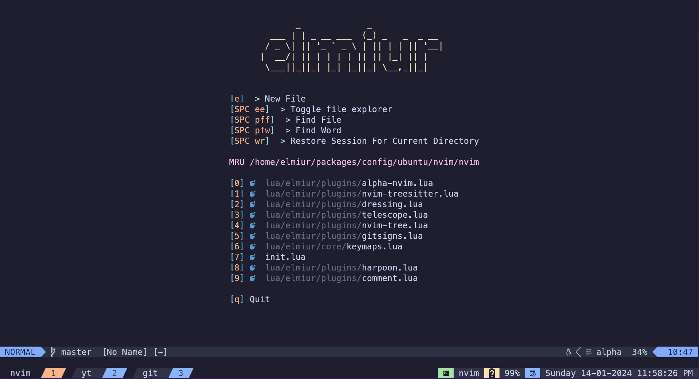

## Ubuntu Setup

|                                                   |                                                 |
| :-----------------------------------------------: | :---------------------------------------------: |
|  |  |
|              |        |

This is my attempt to configure ubuntu for my future needs. This project will include

- kitty, powerline10k, ranger setup in `patagonia` theme
- nvim and tmux in `catppuccin` theme
- Install instructions for all the packages that I use for daily workflow and fun
- Notes for certain setups and usage with personal keymaps

## Packages

1. ## **build-essentials**

   ```sh
   sudo apt install build-essential -y
   ```

1. ## **git**

   #### Install & Configure

   ```sh
   sudo apt install git -y &&
   ln -sf ~/packages/config/ubuntu/dotfiles/.gitconfig ~/.gitconfig
   ```

   #### Setup SSH

   ```sh
   cd ~/.ssh &&
   ssh-keygen -t ed25519 -f github
   ```

1. ## **curl**

   ```sh
   sudo apt update &&
   sudo apt install curl -y
   ```

1. ## **xclip**

   This will let me use + and \* on vim/nvim for clipboard copy and paste.

   ```sh
   sudo apt update &&
   sudo apt install xclip -y
   ```

1. ## **kitty**

   Follow the directory for install instructions

1. ## **LAMP/LEMP/LEPP Setup**

   Follow the directory for install instructions

1. ## **Create a passwordless guest user**

   1. Create a user named `guest` with a temporary password
      ```sh
       sudo adduser guest
      ```
   1. Remove password for this user
      ```sh
      sudo passwd -d guest
      ```

1. ## **FUSE**

   Read more in [here](https://github.com/AppImage/AppImageKit/wiki/FUSE)
   For Ubuntu (>= 22.04):

   ```sh
   sudo add-apt-repository universe &&
   sudo apt install libfuse2
   ```
1. ## **fnm**

   ```sh
   curl -fsSL https://fnm.vercel.app/install | bash &&
   fnm use 18
   ```

1. ## **bun**

   For more info, look at the [official website](https://bun.sh/docs/installation)
   ```sh
   curl -fsSL https://bun.sh/install | bash
   ```

1. ## **vim**

   Follow the directory for install instructions

1. ## **neovim**

   Follow the directory for install instructions

1. ## **font-manager**

   This will help you install and manage fonts with ease for gnome distributions, find more [here](https://github.com/FontManager/font-manager).

   ```sh
   sudo add-apt-repository ppa:font-manager/staging &&
   sudo apt-get update &&
   sudo apt-get install font-manager
   ```

1. ## **zsh**

   Follow the directory for install instructions

1. ## **tmux**

   Follow the directory for install instructions

1. ## **dbeaver**

   Install dbeaver debian package from the [official website](https://dbeaver.io/download)

1. ## **neofetch**

   ```sh
   sudo apt install neofetch -y
   ```

1. ## **local wordpress**

   - #### Install local
     Download local from [here](https://cdn.localwp.com/stable/latest/deb), if this doesn't work then go to their [official website](https://localwp.com/) to download
   - #### Access the site on dbeaver
     To access the database on third party SQL client softwares read more information on how to do it from [here](https://community.localwp.com/t/how-can-i-connect-to-mysql-using-tcp-ip-rather-than-a-socket-on-macos-linux/21220)

1. ## **docker**

   Install docker following the instructions from the [official website](https://docs.docker.com/engine/install/ubuntu/#installation-methods)

1. ## **cool-retro-term**

   ```sh
   sudo apt install cool-retro-term -y
   ```

   Follow the directory for more themes and instructions

1. ## **qBittorrent**

   Download a little old version from apt repository

   ```sh
   sudo apt install qbittorrent -y
   ```

   If you want the latest version then download the AppImage form the [official website](https://www.fosshub.com/qBittorrent.html) and have it placed under `/usr/local/bin`

1. ## **VSCode**

   - Download `spacemono NF` font to support editor font inside vscode from [here](https://github.com/ryanoasis/nerd-fonts/releases/download/v3.1.1/SpaceMono.zip) or go to the [fonts website](https://github.com/ryanoasis/nerd-fonts/releases/download/v3.1.1/SpaceMono.zip). Install it using the `font-manager`.
   - Download the `.deb` by clicking [here](https://code.visualstudio.com/sha/download?build=stable&os=linux-deb-x64), if that doesn't work then download it from the [official website](https://code.visualstudio.com/Download#)

1. ## **IntelliJ IDEA**

   Follow the directory for install instructions

1. ## **filezilla**

   ```sh
   sudo apt install filezilla -y
   ```

1. ## **ghostwriter**

   ```sh
   sudo add-apt-repository ppa:wereturtle/ppa &&
   sudo apt update &&
   sudo apt install ghostwriter -y
   ```

   Check the official [website](https://ghostwriter.kde.org/download/) detail for more details

1. ## **vlc**

   ```sh
   sudo snap install vlc
   ```

   Check the official [website](https://www.videolan.org/vlc/) detail for more details

1. ## **clockify**

   Install clockify following the instructions from the [official website](https://clockify.me/apps)

1. ## **spotify**

   More details on installation, visit [official website](https://www.spotify.com/de-en/download/linux/)

   ```sh
   curl -sS https://download.spotify.com/debian/pubkey_6224F9941A8AA6D1.gpg | sudo gpg --dearmor --yes -o /etc/apt/trusted.gpg.d/spotify.gpg &&
   echo "deb http://repository.spotify.com stable non-free" | sudo tee /etc/apt/sources.list.d/spotify.list &&
   sudo apt-get update && sudo apt-get install spotify-client
   ```

1. ## **discord**

   More details on installation, visit [official website](https://discord.com/download)

   ```sh
   curl -Lo discord.deb "https://discord.com/api/download?platform=linux&format=deb" &&
   sudo apt install ./discord.deb -y
   ```

1. ## **postman**

   Follow the directory for install instructions

1. ## **blender**

   Follow the directory for install instructions

1. ## **obsidian**

   Download the debian package from [official website](https://obsidian.md/download)

1. ## **calibre**

   For install and update run this script
   ```sh
   sudo -v && wget -nv -O- https://download.calibre-ebook.com/linux-installer.sh | sudo sh /dev/stdin
   ```
   Look for more instruction in [official website](https://calibre-ebook.com/download)

1. ## **mailhog**

   Follow the directory for install instructions

1. ## **wakatime**

   ```sh
   ln -s ~/packages/config/ubuntu/dotfiles/.wakatime.cfg ~/.wakatime.cfg
   ```

   Go to wakatime [webiste](https://wakatime.com/) -> settings and get the `secret api key` and replace that inside the file. Current key is old.

   ```sh
   vim ~/packages/config/ubuntu/dotfiles/.wakatime.cfg
   ```
